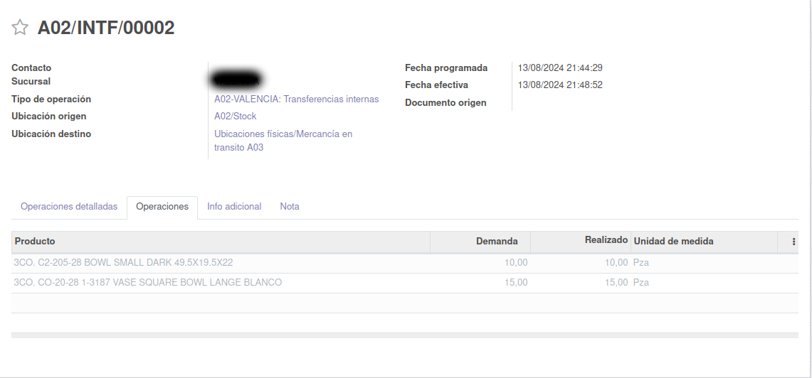

# Odoo: shipping_and_receiving_pickings

####    Module that speeds up the reception of transfers between warehouses.

This module enables a wizard that lists pending shipments that have not been fully received by the destination warehouse. Transfers between warehouses are considered to be those transfers whose type of operation is internal and is carried out from the stock of one warehouse to the transit of another warehouse, both from the same company.

